# 🔓 Hackathon: CyberSafe 
> **Устройство CyberSafe (MCU RP2040) было взломано 11 различными способами из всех классов атак.**


## 📋 Содержание

- [Описание векторов атаки](#описание-векторов-атаки)
- [Ключевые уязвимости](#ключевые-уязвимости)
- [1. Брутфорс](#1-брутфорс)
- [2. Получение полного дампа flash-памяти](#2-получение-полного-дампа-flash-памяти)
  - [2.1. Получение дампа через SWD интерфейс](#21-получение-дампа-через-swd-интерфейс)
  - [2.2. Получение дампа через boot режим (USB PicoBoot)](#22-получение-дампа-через-boot-режим-usb-picoboot)
  - [2.3. Получение дампа через SPI напрямую с микросхемы памяти](#23-получение-дампа-через-spi-напрямую-с-микросхемы-памяти)
- [3. Анализ дампа памяти](#3-анализ-дампа-памяти)
  - [3.1. Поиск пин-кода в дампе](#31-поиск-пин-кода-в-дампе)
  - [3.2. Извлечение файловой системы напрямую из дампа](#32-извлечение-файловой-системы-напрямую-из-дампа)
- [4. Способы через SWD интерфейс](#4-способы-через-swd-интерфейс)
  - [4.1. Подмена пароля в RAM](#41-подмена-пароля-в-ram)
  - [4.2. Посмотреть пароль в ячейке памяти](#42-посмотреть-пароль-в-ячейке-памяти)
  - [4.3. Изменение пароля на 0000](#43-изменение-пароля-на-0000)
- [5. Взлом через модифицированные прошивки](#5-взлом-через-модифицированные-прошивки)
  - [5.1. Изменение PIN кода на 0000](#51-изменение-pin-кода-на-0000)
  - [5.2. Отключение PIN кода](#52-отключение-pin-кода)
- [6. Финальный аккорд — копаем 1337 слоёв](#6-финальный-аккорд--копаем-1337-слоёв)
- [Рекомендации](#рекомендации)

---

## Описание векторов атаки

Устройство **CyberSafe (MCU RP2040)** было полностью взломано **11 различными способами** из всех классов атак:

| № | Способ | Класс атаки | Сложность | Достигнутый результат |
|---|--------|-------------|-----------|----------------------|
| 1 | Автоматический перебор PIN с энкодера (ESP32 + автостоп по WS2811) | Перебор / side-channel индикации | Средняя | Пароль **6061** найден за 4.5 ч |
| 2 | Полный дамп flash через SWD (пайка к SWCLK/SWDIO) | Аппаратная / физическая | Средняя | `firmware_dump.bin` (2 МБ) |
| 3 | Полный дамп flash через USB PicoBoot (BOOTSEL) | USB / программная | Низкая | `dump.bin` (2 МБ) |
| 4 | Полный дамп flash через SPI напрямую с микросхемы памяти | Физическая (чтение памяти) | Средняя | `flash_dump.bin` (2 МБ) |
| 5 | Извлечение PIN из прошивки (реверс в Ghidra) | Программная | Низкая | PIN **6061** |
| 6 | Дешифровка ФС из дампа (XOR-ключ из прошивки) — доступ к данным без пароля | Программная / криптографическая | Низкая | `disk.img` -> приз |
| 7 | Подмена ожидаемого PIN в RAM через SWD (breakpoint) | Аппаратная / программная | Средняя | Обход без знания PIN |
| 8 | Чтение PIN из flash через SWD | Аппаратная | Низкая | PIN **6061** |
| 9 | Перезапись PIN в flash через SWD в 0000 | Аппаратная | Низкая | Обход по PIN 0000 |
| 10 | Пропатченная прошивка (PIN 0000), прошивка через BOOTSEL | Программная | Низкая | Обход по PIN 0000 |
| 11 | Пропатченная прошивка (удалён вызов `lock_ui()`) | Программная | Низкая | Полный обход PIN |

---

## Ключевые уязвимости

- ❌ **SWD невозможно отключить** на этом микроконтроллере
- ❌ **PicoBoot не отключён**
- ❌ **Нет secure boot / подписи прошивки**
- ❌ **PIN хранится в открытом виде**
- ❌ **Шифрование ФС не зависит от PIN**
- ❌ **Нет анти-брутфорса**

---

## 1. Брутфорс

Для автоматизации процесса подбора пароля было решено эмулировать вращение и нажатие на энкодер с помощью стороннего микроконтроллера. По трассировке платы и распиновке энкодера были определены пины:

- **GPIO27** и **GPIO29** — вращение энкодера
- **GPIO28** — нажатие

К этим пинам был подключен микроконтроллер **ESP32**.

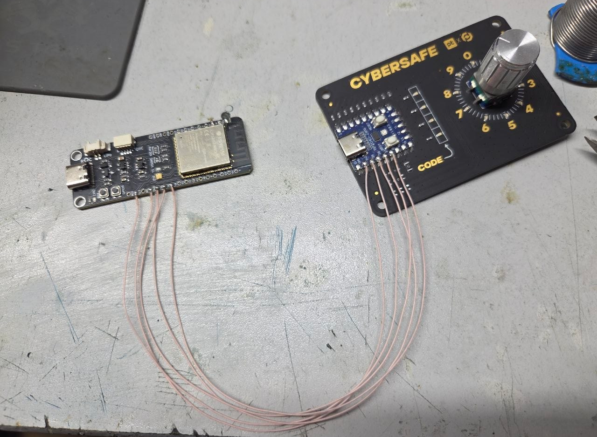

С помощью осциллографа была определена предельно стабильная частота импульсов и их продолжительность.

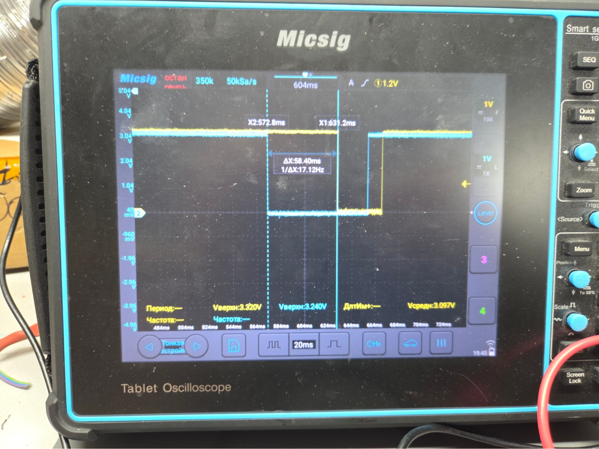

[Далее был написан код](https://github.com/gestitech/hackaton_LDT2026/blob/main/Brute%20Force/ESP32BruteForce.ino), который поочерёдно перебирает числа от `0000` до `9999`, на каждую цифру генерирует соответствующее количество импульсов «энкодера», после чего нажимает кнопку. Далее аналогично со следующими цифрами числа.

С учётом всех задержек (перед нажатием кнопки и во время её удержания, после ввода отдельной цифры или неверного числа) расчётное время полного перебора занимает порядка **6 часов**.

> В нашем случае спустя **4.5 часа** был подобран пароль **6061**.

**Видеоподтверждение:** [vkvideo.ru](https://vkvideo.ru/video-241723191_456239025?list=In-PKEICcR9kCApmB4x2D)

Остановку процесса перебора можно было реализовать через факт появления USB-устройства в ПК, но мы пошли другим, более весёлым, путём.

Для своевременной остановки процесса перебора была реализована следующая схема: с учётом того, что для индикации о неуспешной попытке ввода пароля используется адресный светодиод **WS2812B** (мигает красным цветом), была выдвинута гипотеза, что в момент ввода верного пароля этот светодиод будет так или иначе выводить индикацию **зелёным** цветом. Именно этот момент было принято считать за момент остановки перебора.

Для получения сигнала был припаян провод к контакту **DIN** светодиода (**GPIO16 RP2040**).

Для простого декодирования цифрового сигнала со светодиода использовалась микросхема **WS2811**: производителем предполагается подключение к трём выходным контактам данной микросхемы катодов трёх светодиодов (RGB). Иными словами, при получении пакета, имеющего зелёный канал света, на **pin2** микросхемы подаётся **GND**. Мы же использовали появляющийся GND как логический «0», означающий, что на плате загорается зелёный светодиод и надо останавливать перебор.

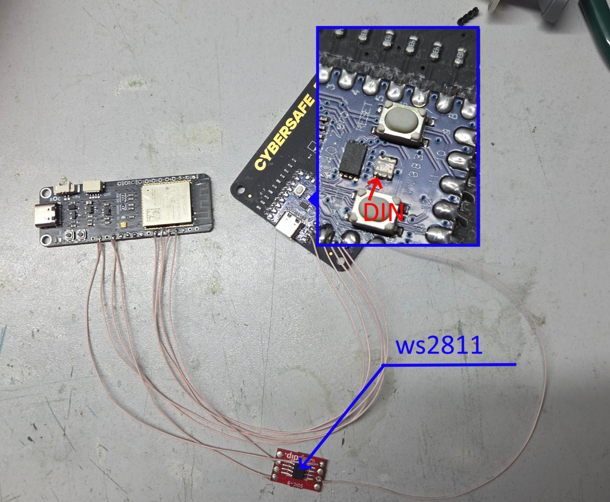

> ⚠️ **Возможным вариантом защиты от брутфорса** является добавление задержки в случае ввода неправильного пароля. Также следует добавить задержку при старте кода, т.к. в ином случае можно будет обходить вышеописанную задержку путём перезагрузки микроконтроллера контактом **RST**.

---

## 2. Получение полного дампа flash-памяти

### 2.1. Получение дампа через SWD интерфейс

На микроконтроллере **RP2040** (который применяется в предоставленной плате) присутствует интерфейс **SWD**, предназначенный для отладки. У многих микроконтроллеров имеется возможность программно отключить доступ к этому интерфейсу, однако микроконтроллер RP2040 **не имеет такой возможности**, что является большой уязвимостью.

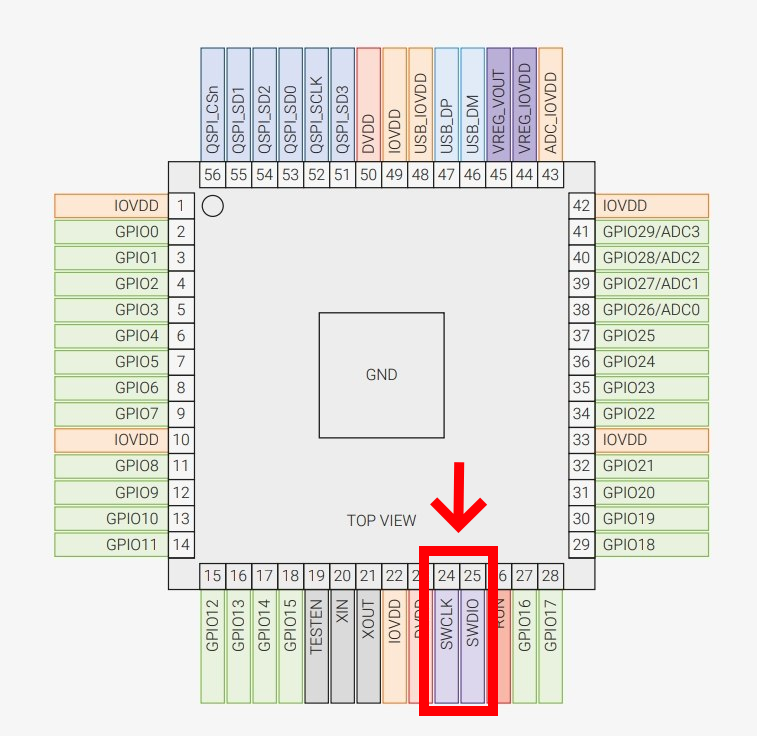

Однако на предоставленной плате данные контакты не были выведены, поэтому напрямую к пинам микроконтроллера были припаяны два провода: **SWCLK** и **SWDIO**.

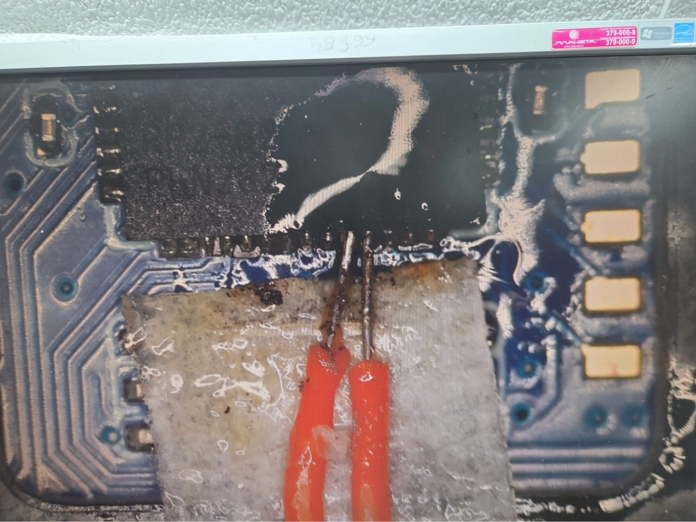

Далее они были подключены к преобразователю **FT232** следующим образом:

| FT232H | RP2040 |
|--------|--------|
| D0     | SWCLK  |
| D1 / AD1 | SWDIO |
| GND    | GND    |
| 3.3V   | 3V3    |

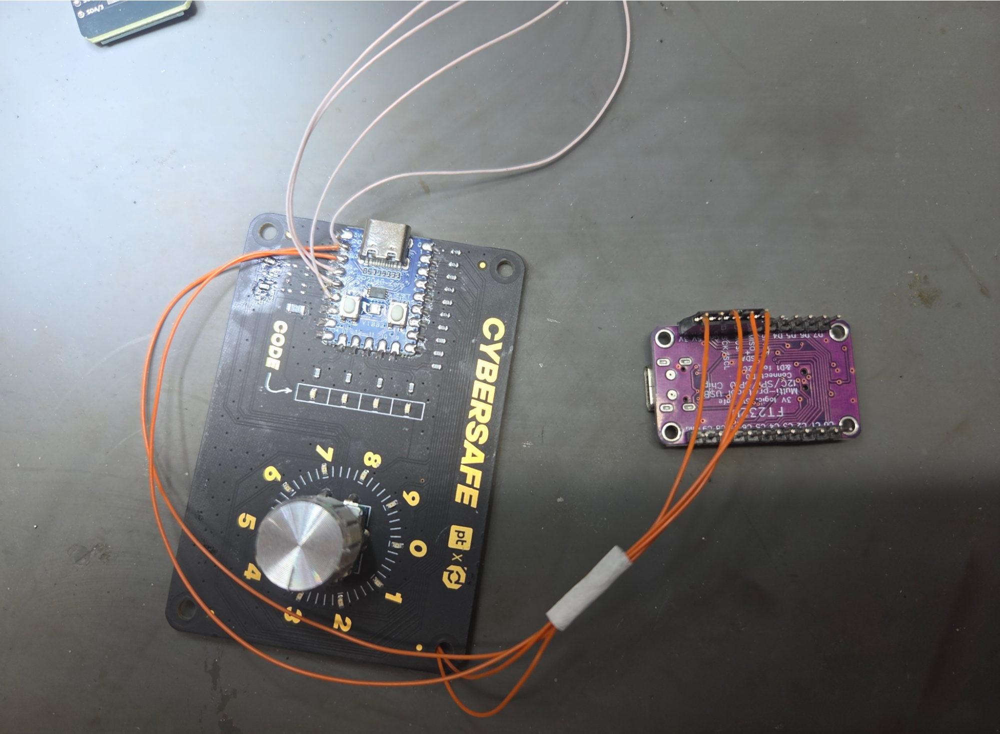
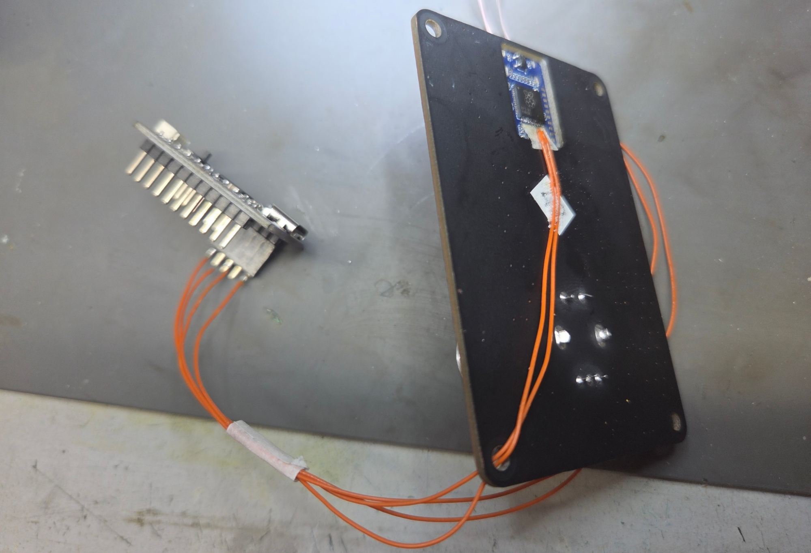

Подключив плату через преобразователь к ПК, используя программу для отладки **OpenOCD**, а также **GDB (GNU Debugger)**, появляется возможность подключиться к микроконтроллеру:

1. Для **FT232H** установить драйвер **WinUSB**.
2. Запустить **OpenOCD** и подключиться к FT232h:
   ```bash
   C:\Users\Сергей\AppData\Roaming\xPacks\openocd\xpack-openocd-0.12.0-7\bin\openocd.exe -f interface/ftdi/ft232h-module-swd.cfg -c "adapter speed 100" -f target/rp2040.cfg
   ```
3. Далее в отдельной cmd запустить **GDB** и подключиться к OpenOCD:
   ```bash
   arm-none-eabi-gdb
   target extended-remote localhost:3333
   ```

Теперь с помощью различных команд можно останавливать и запускать работу ядра, получать данные к памяти и т.п. На основе этой возможности будет описано ниже ряд уязвимостей:

1. Для начала необходимо сбросить микроконтроллер и остановить выполнение программы:
   ```bash
   monitor reset halt
   ```
2. Далее, после многих попыток и комбинаций, стало понятно что нужно сделать флеш-память доступной для чтения по адресу XIP, для этого выполнить команду:
   ```bash
   monitor rp2xxx_rom_api_call CX
   ```
3. Командой `monitor mdw 0x10000000 16` следует убедиться, что память читается исправно: должны появиться данные, отличные от `000000ff`.
4. После этого можно скачать полный дамп памяти командой:
   ```bash
   dump binary memory firmware_dump.bin 0x10000000 0x10200000
   ```
5. Сформируется файл **firmware_dump.bin** размером **2 097 152 байта** (0x200000), который будет содержать в себе всё что хранится внутри флеш-памяти раздела XIP платы.

**Файл полученного дампа:** [swd_dump.bin](https://github.com/gestitech/hackaton_LDT2026/blob/main/binary/swd_dump.bin)

**Видеоподтверждение:** [vkvideo.ru](https://vkvideo.ru/video-241723191_456239021?list=In-OURtQFXVXCHYXLf0aM)

---

### 2.2. Получение дампа через boot режим (USB PicoBoot)

В даташите на RP2040 (**Раздел 2.8.4. USB PICOBOOT Interface, Страница 172**) упоминается наличие интерфейса **PicoBoot**, который позволяет получить доступ к чтению памяти, записи и т.п. напрямую через USB-разъём. Однако в даташите также сказано, что этот интерфейс **может быть отключён** (в отличие от SWD).

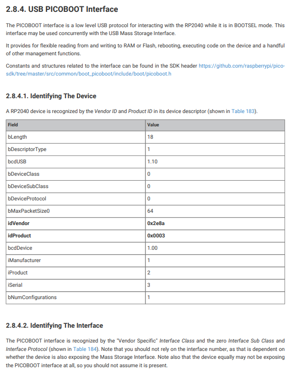

Однако проверить возможность подключения по нему к плате однозначно стоит.

Для этого достаточно:

1. Зажать кнопку **BOOT**.
2. Подключить плату к ПК через USB-провод.
3. В cmd выполнить команду:
   ```bash
   picotool info
   ```
   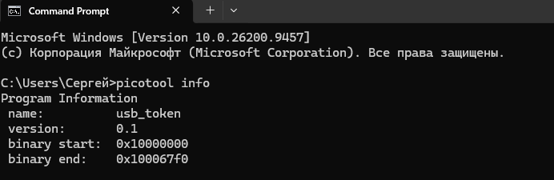
4. В случае если PicoBoot доступен, мы увидим информацию о прошивке (версию, имя и её расположение в памяти).
5. Далее командой:
   ```bash
   picotool save -r 0x10000000 0x10200000 dump.bin
   ```
   можно полностью скачать всё содержимое памяти в бинарный файл.

  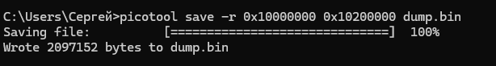

6. Всё! Далее полученный файл можно использовать для любого из вышеописанных способов.

**Файл полученного дампа:** [picotool_dump.bin](https://github.com/gestitech/hackaton_LDT2026/blob/main/binary/picotool_dump.bin)

**Видеоподтверждение:** [vkvideo.ru](https://vkvideo.ru/video-241723191_456239022?list=In-hTrYQrs1xjZGszWQaC)

---

### 2.3. Получение дампа через SPI напрямую с микросхемы памяти

Для начала необходимо отпаять микросхему памяти, расположена она рядом с разъёмом **Type-C**. На оригинальной плате от Waveshare установлена микросхема **W25Q16JVUXIQ**, на данной копии — клон этой микросхемы **BoHong B.25D16**. На микросхеме ключ, обозначающий 1 контакт, имеет еле заметный контур — поэтому лучше сразу запомнить, где и как располагается первый контакт относительно маркировки.

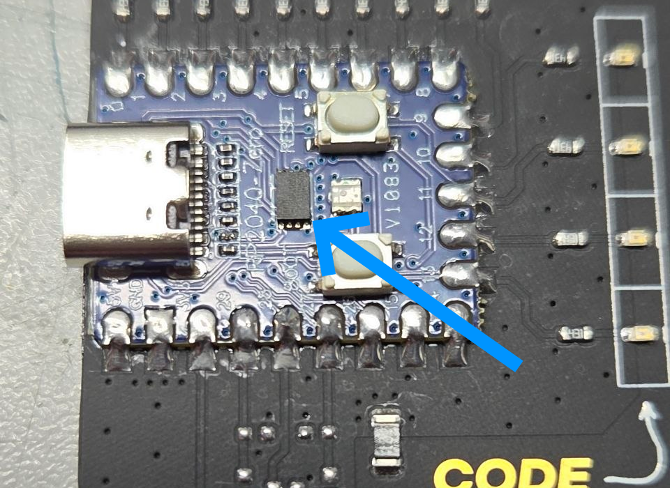

Далее полученную микросхему необходимо запаять на макетную плату, которая позволяет получить хороший доступ к контактам микросхемы. В нашем случае платы с идеально подходящим посадочным местом не было, поэтому микросхема была запаяна вверх ногами на проволочки.

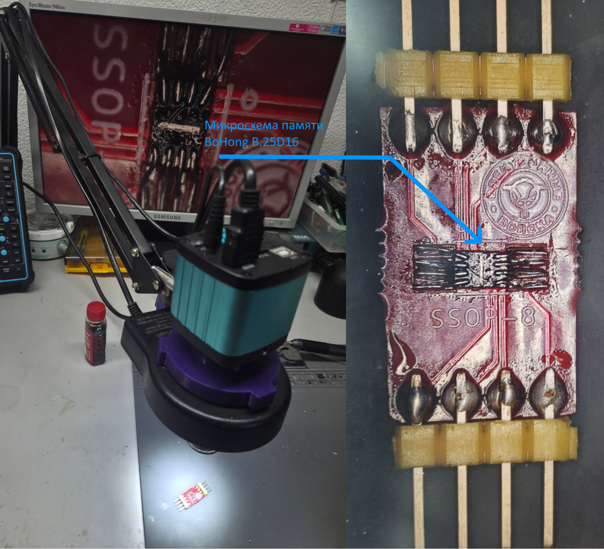

После пайки обозначить пины — какой за что отвечает. Для этого будем ориентироваться на даташит микросхемы памяти, а также принципиальную схему платы от Waveshare. Дополнительно стоит мультиметром прозвонить линии питания (**3.3V** и **GND**), чтобы убедиться в правильности их подключения. Т.к. при ошибке в сигнальных контактах вероятность микросхемы сгореть минимальна, но если перепутать линии питания — шанс, что «выйдет белый дым» — почти гарантирован.

Подключаем следующим образом:

| FT232H | W25Q16JVUXIQ |
|--------|--------------|
| D0     | CLK          |
| D1     | DI           |
| D2     | DO           |
| D3     | CS           |
| 3.3V   | 3.3V         |
| GND    | GND          |

1. Подключаем преобразователь к ПК.
2. Для **FT232H** устанавливаем драйвер **WinUSB**.
3. Скачиваем **[flashrom](https://github.com/therealdreg/flashrom_build_windows_x64/releases)**.
4. Проверим, что flashrom видит память командой:
   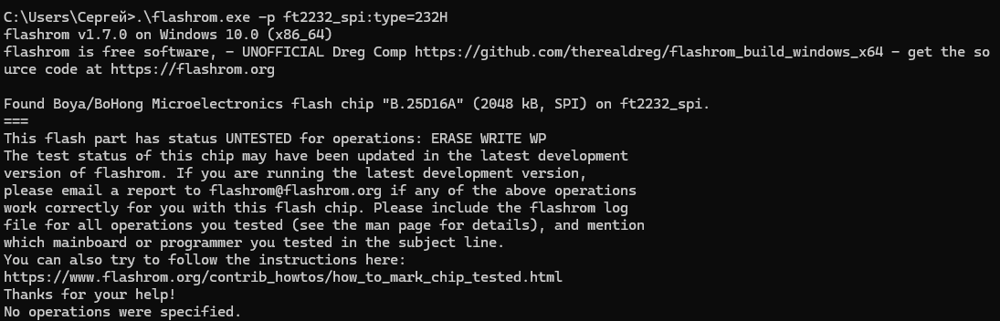

5. В случае, если память успешно увиделась — выполняем команду на получение полного дампа:
   ```bash
   .\flashrom.exe -p ft2232_spi:type=232H -r dump.bin
   ```

   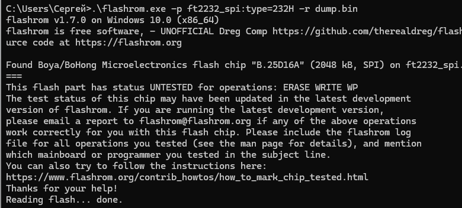

Готово, у нас сформировался файл `dump.bin`, который содержит полный дамп памяти.

Командой `.\flashrom.exe -p ft2232_spi:type=232H -w dump.bin` можно записать изменённый по одному из ниже описанных способов новый дамп. К примеру, поменять в регистре `0x10005500` пароль на новый и записать обратно новый дамп.

**Файл полученного дампа:** [spi_dump.bin](https://github.com/gestitech/hackaton_LDT2026/blob/main/binary/spi_dump.bin)

**Видеоподтверждение:** [vkvideo.ru](https://vkvideo.ru/video-241723191_456239026?list=In-sLGcxyahPrr1ZVmjVJ)

---

## 3. Анализ дампа памяти

### 3.1. Поиск пин-кода в дампе

Стоит убедиться, что размер дампа составляет **2 097 152 байта**. Проверка размера файла (на Linux):

```bash
ls -lh firmware_dump.bin
```

После просмотра дампа была выявлена следующая структура: первый **1 МБ** памяти выделен под хранение прошивки микроконтроллера, а второй **1 МБ** памяти выделен под хранение файлов. Таким образом, со смещения `0x100000` начинается файловая система размером 1 МБ — будем её извлекать.

Используемая плата является клоном на **RP2040-zero** от Waveshare. Плата построена на базе микроконтроллера **RP2040** от Raspberry Pi ([Datasheet](https://static.chipdip.ru/lib/050/DOC007050295.pdf)). Нам важно, что внутри используется процессор **Dual ARM Cortex-M0+ 133MHz**.

Ниже представлена карта регистров (таблица 15, раздел 2.2 Address Map в даташите):

| Регион | Адрес |
|--------|-------|
| ROM | `0x00000000` |
| XIP | `0x10000000` |
| SRAM | `0x20000000` |
| APB Peripherals | `0x40000000` |
| AHB-Lite Peripherals | `0x50000000` |
| IOPORT Registers | `0xd0000000` |
| Cortex-M0+ internal registers | `0xe0000000` |

Важный здесь пункт — **XIP (execute-in-place)** — это место, где лежит прошивка нашего микроконтроллера. Запомним, что она начинается с адреса `0x10000000` (для удобства счёта нулей `0x10.000.000`).

#### Описание разделов

1. **ROM — `0x00000000` (Внутреннее ПЗУ)**
   Это неизменяемая память (объёмом 16kB read-only), которая зашивается в чип на заводе при его производстве. Содержимое ROM прошивается в кремний на заводе при производстве. В ROM содержится:
   - Программа первоначального запуска микроконтроллера (Initial startup routine)
   - Последовательность загрузки из Flash-памяти (через XIP) (Flash boot sequence)
   - Программы для записи/чтения Flash-памяти (Flash programming routines)
   - Программа для определения микроконтроллера как USB-устройства для прошивки (USB mass storage device with UF2 support)
   - Утилиты, библиотеки для операций с числами с плавающей точкой (Utility libraries such as fast floating point)

2. **XIP — `0x10000000` (Внешняя Flash-память)**
   eXecute-in-Place (выполнение на месте). Это диапазон, на который аппаратно проецируется прошивка, физически находящаяся на внешней микросхеме памяти. Процессор ARM Cortex-M0+ считывает инструкции вашей программы напрямую из этого диапазона, не копируя в RAM. Аппаратный контроллер XIP автоматически кэширует данные, чтобы чтение по внешней шине QSPI происходило максимально быстро.

3. **SRAM — `0x20000000` (Оперативная память)**
   Статическая оперативная память (Static RAM) общего назначения объёмом **264 КБ**. Это временная память, которая полностью очищается при выключении питания.

4. **APB Peripherals — `0x40000000` (Периферия на шине APB)**
   Advanced Peripheral Bus — относительно медленная, но энергоэффективная системная шина для управления встроенными блоками чипа. Записью байт по этим адресам можно управлять «железом» микроконтроллера. Сюда подключены:
   - Таймеры и системные часы (Clocks)
   - Блоки UART (последовательный порт)
   - Блоки SPI и I2C
   - Контроллер ШИМ (PWM)
   - Регистры конфигурации ввода-вывода (выбор режима работы ножек: цифровой, аналоговый, подтяжка к питанию/земле)

5. **AHB-Lite Peripherals — `0x50000000` (Высокоскоростная периферия)**
   Advanced High-performance Bus — быстрая системная шина для компонентов, которым критична скорость передачи данных без задержек. Через этот диапазон адресов процессор общается с самыми прокорливыми до скорости модулями:
   - Контроллер DMA (Direct Memory Access — позволяет пересылать мегабайты данных из памяти в периферию без участия центрального процессора)
   - Контроллер USB 1.1 (для работы устройства в качестве USB-мыши, клавиатуры или виртуального COM-порта)
   - Контроллер PIO (Programmable I/O — фишка RP2040, позволяющая создавать собственные аппаратные интерфейсы на базе мини-автоматов состояний)

6. **IOPORT Registers — `0xd0000000` (Регистры быстрого ввода-вывода)**
   Специализированный сверхбыстрый интерфейс (Single-cycle IO block) для управления пинами микроконтроллера. Это позволяет «дёргать» ножками микроконтроллера на экстремально высокой частоте.

7. **Cortex-M0+ internal registers — `0xe0000000` (Внутренние регистры ядра ARM)**
   Стандартный для всех процессоров архитектуры ARM Cortex-M блок системных регистров управления самим процессорным ядром. Эти адреса заложены архитектурой ARM. Через них настраивается базовые функции ядра:
   - Контроллер прерываний NVIC (включение, выключение и приоритизация прерываний от периферии)
   - Системный таймер SysTick (тот самый, от которого тикают миллисекунды в операционных системах типа FreeRTOS или функциях задержки)
   - Регистры управления отладкой (Core Debug) для работы программаторов по интерфейсу SWD

Далее устанавливаем **Ghidra** для дизассемблирования дампа и его анализа кода: **[Ghidra](https://github.com/NationalSecurityAgency/ghidra/releases)**

При импортировании файла выбираем процессор **ARM v6 32bit default compiler little endian (ARM:LE:32:v6:default)** и в доп. опциях обязательно указываем базовый адрес `0x10000000` (как это было в Address map для XIP). Поле **Length** выставится автоматически, основываясь на размере файла дампа (2МБ). Галочки желательно включить обе.

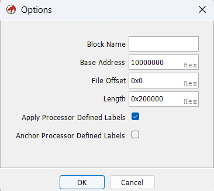

Дополнительно необходимо установить плагин: **[GhidraSVD](https://github.com/antoniovazquezblanco/GhidraSVD/releases/tag/v0.6.5)** и скачать **.svd** файл для микроконтроллера RP2040 ([RP2040.svd](https://github.com/raspberrypi/pico-sdk/blob/master/src/rp2040/hardware_regs/RP2040.svd)). Запустить плагин с этим файлом — это поможет при дизассемблировании дать осмысленные имена системным адресам, ведущим к периферии.

В самом начале дампа лежит загрузчик, его размер 256 байт. Нас интересует адрес 0x10000100

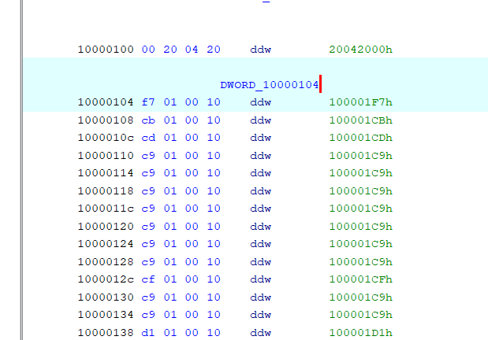

Первый адрес `0x100100` ссылается на `0x20042000` — это RAM. Следующий, подходящий нам, на который нас кинет загрузчик — это `0x10000104`, внутри него лежит `0x100001F7`, поскольку адрес нечётный, младший бит означает **Thumb**, а сама первая инструкция лежит на `0x100001F6` — это функция `reset_handler`. Листаем до неё:

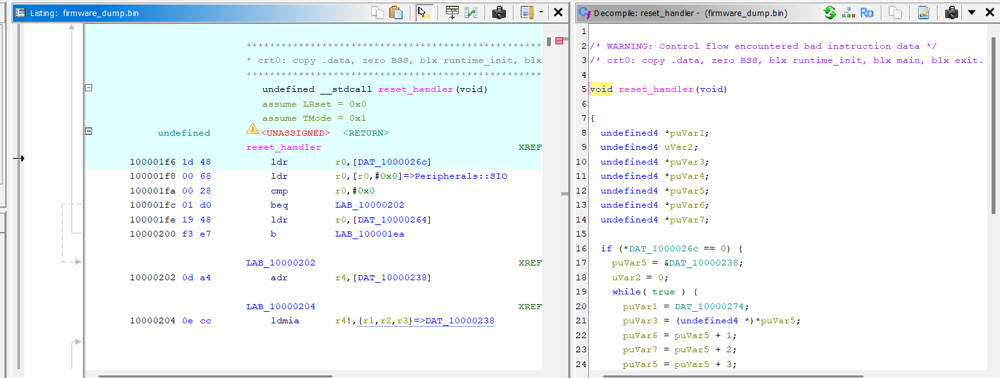

Нас интересует место с тремя `blx` подряд — вызовы функций.


Первый вызов — `init`, второй вызов — `main` (он нам нужен!), и третий — `exit`. Аналогично пристальным взглядом устанавливаются названия других функций. `main` будет выглядеть так:

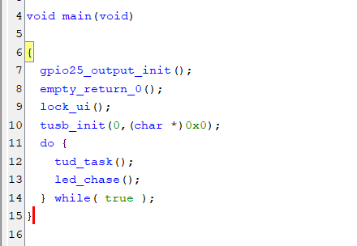

Чтобы дать осмысленные имена функциям, рекомендуем воспользоваться нашим скриптом (для этого надо предварительно установить pythagdra и правильно запустить Ghidra). Сам скрипт: [RenameUsbToken.py](https://github.com/gestitech/hackaton_LDT2026/blob/main/Search%20PIN%20in%20dump/RenameUsbToken.py)

Из функции `lock_ui()` (адрес `0x10000ab0`) можно найти адреса, где лежит ПИН:

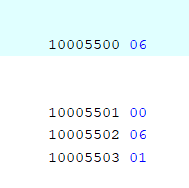

**Пин, исходя из анализа прошивки: 6061**

Дальше можно ввести этот пароль с энкодера и получить доступ к USB-накопителю с призом.

**Файл кода, полученный автогенерацией Ghidra:** [firmware_dump.c](https://github.com/gestitech/hackaton_LDT2026/blob/main/Memory%20dump%20analysis/firmware_dump.bin.c), [firmware_dump.h](https://github.com/gestitech/hackaton_LDT2026/blob/main/Memory%20dump%20analysis/firmware_dump.bin.h)

> (Код не представляет собой полностью работоспособную версию, однако позволяет хорошо изучить его логику работы, что сильно пригодится в дальнейших методах.)

---

### 3.2. Извлечение файловой системы напрямую из дампа

Докопаемся до приза вообще не зная пин-кода энкодера! :)

Вспоминая (и листая листинг в Ghidra), получаем, что в диапазоне `0x10000000`–`0x100ffff` лежит код прошивки, а в диапазоне `0x10100000`–`0x101ffff` — файловая система (которая становится доступна после ввода пин-кода). С ней работает библиотека USB и даёт доступ к ПК, но мы обойдёмся без неё.

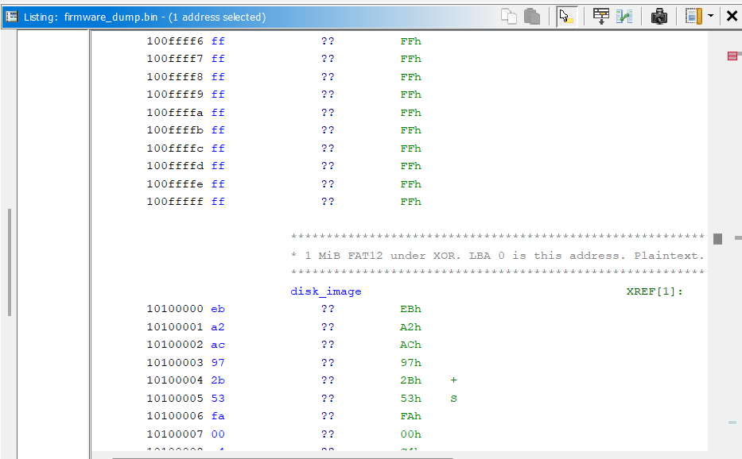

Библиотека USB начинает читать ФС (файловую систему) начиная с адреса `0x10100000`, и на этот адрес ссылается функция (комментарий Ghidra XREF[1]). Если был запущен наш скрипт-автоименования, то это будет функция `tud_msc_read10_cb` (по адресу `0x10000354`). Это функция-колбек библиотеки работы с USB. Когда хост (наш ПК) запрашивает очередную порцию данных, то эта функция дешифрует на лету данные ФС.

**Параметры:**
- `param_1` — LUN — номер диска (не используется)
- `param_2` — LBA, номер сектора
- `param_3` — смещение внутри первого сектора, 0…511
- `param_4` — буфер хоста, куда класть ответ

Дальше каждый сектор ксорится с ключом, база ключа зашита в прошивке, плюс ксор идёт с номерами байтов → поэтому один и тот же байт в разных частях ФС будет зашифрован по-разному.

Мы написали скрипт на Python [decrypt.py](https://github.com/gestitech/hackaton_LDT2026/blob/main/File%20from%20dump/decrypt.py), который извлекает из дампа второй мегабайт данных (где лежит зашифрованная ФС), дешифрует её по алгоритму функции `tud_msc_read10_cb`, и сохраняет отдельным файлом. Если после запуска скрипта открыть получившийся файл `disk.img` в hex-редакторе, то сможем увидеть уже что-то осмысленное:

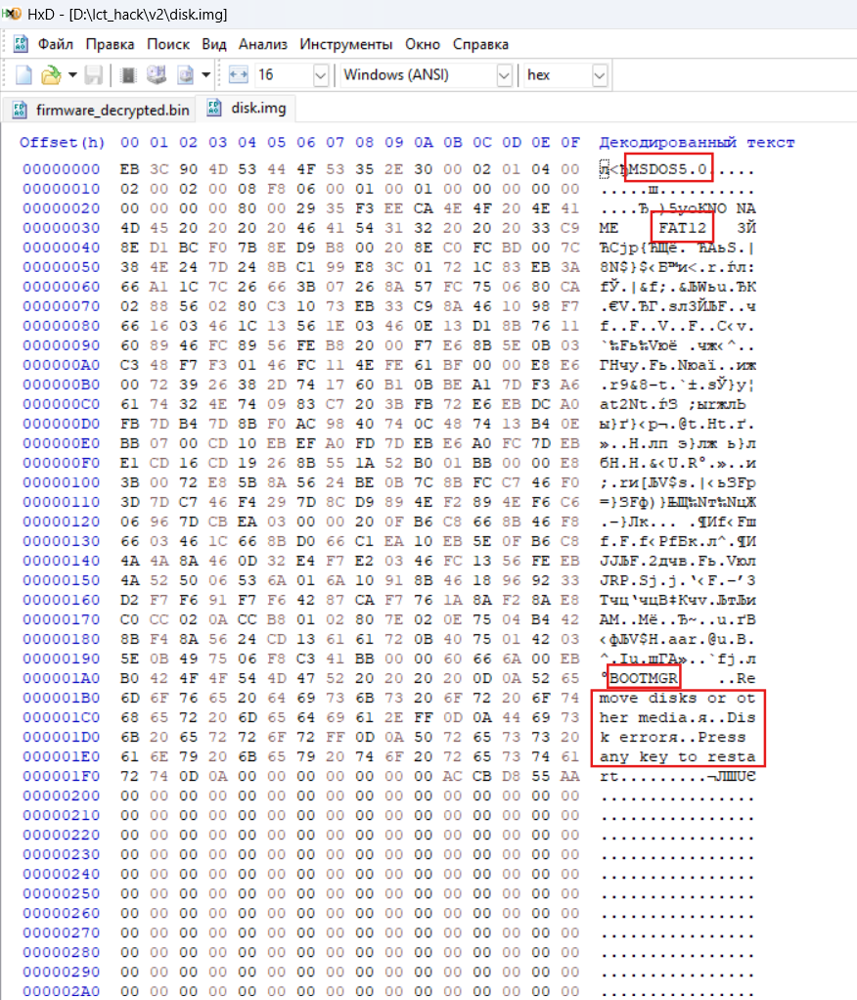

Далее этот файл можно просто открыть через **7-Zip** и увидеть приз:

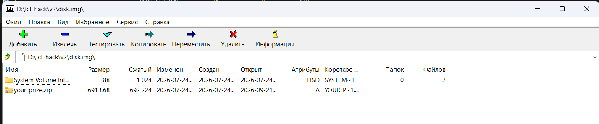

---

## 4. Способы через SWD интерфейс

### 4.1. Подмена пароля в RAM

> ⚠️ **Замечание:** все описанные ниже адреса можно получить не только через полный анализ дампа flash-памяти, но и путём постоянного снятия состояния RAM через отладку и ввода различных паролей. Сравнивая состояния RAM между поворотом энкодера, вводом цифры, можно понять, какие адреса в памяти меняются и реагируют.

На основе дизассемблированного кода, полученного в способе 2, были выявлены некоторые функции алгоритма:

На уровне ассемблера проверка правильности работы пароля работает следующим образом: прошивка последовательно сравнивает каждую введённую цифру с цифрой, хранящейся в памяти. В момент сравнения:
- `r2` — фактически введённая цифра
- `r3` — ожидаемая цифра из оригинального пароля
- `cmp r2, r3` — проверка их равенства

Проверка выполняется по адресу:
```
0x10000C8A: cmp r2, r3
```

Если значения различаются, выполняется:
```
0x10000C8C: bne 0x10000CD4
```
и происходит переход в ветку ошибки.

Если значения совпадают, выполняется увеличение счётчика успешных совпадений:
```
0x10000C90: adds r4, #1
```

После проверки всех 4-х чисел проверяется, достиг ли счётчик значения «5»:
```
0x10000C96: cmp r4, #5
0x10000C98: bne 0x10000C82
```

При достижении `r4 = 5` выполняется переход в успешную ветку: `0x10000C9A`.

**Идея метода** сводится не к изменению оригинального пароля во Flash-памяти, а к подмене ожидаемого числа на действительно введённое значение в RAM непосредственно перед каждым сравнением через SWD-интерфейс.

Было: `r2 = введённая цифра, r3 = оригинальная цифра`
Стало: `r2 = введённая цифра, r3 = введённая цифра`

Следовательно, функция `0x10000C8A: cmp r2, r3` всегда будет получать равные значения.

Для этого нужно остановить выполнение программы, поставить точку остановки и запустить выполнение программы — код сам остановится при достижении функции `0x10000c8a`:

```bash
monitor reset halt
b *0x10000C8A
continue
```

После остановки по breakpoint мы увидим в консоли `Breakpoint 7, 0x10000c8a`. В этот момент необходимо выполнить команду `set $r3 = $r2`, которая приравняет ожидаемое к введённому числу внутри оперативной памяти. После этого ввести `continue` для продолжения работы кода. Код остановится **4 раза** по сработке breakpoint. Все 4 раза нужно повторить вышеописанную последовательность команд (4 раза, т.к. происходит сравнение всех 4-х цифр). После четвёртого такого обхода счётчик должен достигнуть требуемого значения, и выполнение продолжится через успешную ветку, и микроконтроллер откроет доступ к флешке.

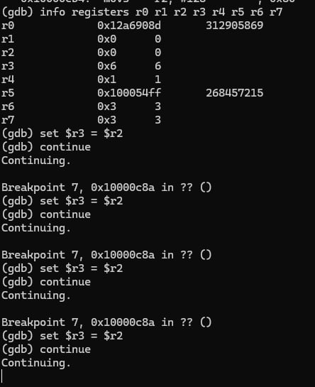

**Преимуществом** такого способа является то, что не происходит никаких изменений прошивки и после перезагрузки устройства никаких изменений во Flash не сохраняется. Технически для такого способа не обязательно знать исходный пароль (хоть мы его и можем узнать прямо в процессе выполнения). Стоит отметить, что этот способ будет работать только с платами, которые прошиты такой же прошивкой. Для иных прошивок необходимо будет сначала декомпилировать код.

**Видеоподтверждение:** [vkvideo.ru](https://vkvideo.ru/video-241723191_456239017?list=In-heY3lgcECMfm9b5GLZ)

---

### 4.2. Посмотреть пароль в ячейке памяти

После дизассемблирования кода, полученного при анализе дампа, был обнаружен регистр `0x10005500`, который хранит правильный пароль. Для получения пароля через SWD необходимо ввести команду:

```bash
monitor flash mdb 0x10005500 4
```

В выводе мы получим:
```
0x10005500: 06 00 06 01
```

Что соответствует паролю **6061**.

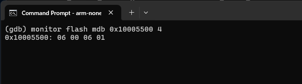

После получения верного пароля его можно ввести вручную с энкодера.

В данном случае, также как и в предыдущем, этот способ будет работать только с платами, которые прошиты такой же прошивкой. Для иных прошивок необходимо будет сначала дизассемблировать код.

**Видеоподтверждение:** [vkvideo.ru](https://vkvideo.ru/video-241723191_456239020?list=In-rvnjghGljDogOgmA6l)

---

### 4.3. Изменение пароля на 0000

После дизассемблирования кода мы знаем о регистре `0x10005500`, который хранит правильный пароль. Для его замены можно поочерёдно поменять 4 байта на 0 во flash-памяти через SWD-интерфейс, для этого:

```bash
monitor flash fillb 0x10005500 0x00 1
monitor flash fillb 0x10005501 0x00 1
monitor flash fillb 0x10005502 0x00 1
monitor flash fillb 0x10005503 0x00 1
```

После этого пароль будет изменён на **0000**, чтобы в этом убедиться, можно использовать команду:

```bash
monitor flash mdb 0x10005500 4
```

Получим результат:
```
0x10005500: 00 00 00 00
```

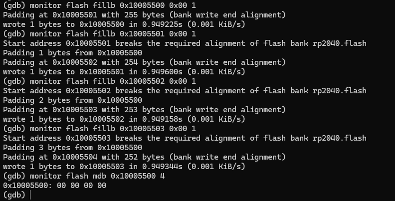

Теперь плата разблокируется по коду **0000**.

**Видеоподтверждение:** [vkvideo.ru](https://vkvideo.ru/video-241723191_456239019?list=In-7dQLw1vw9xWfvHZqki)

---

## 5. Взлом через модифицированные прошивки

### 5.1. Изменение PIN кода на 0000

В предыдущем способе был описан регистр `0x10005500`, который хранит правильный пароль. На основе этих данных была подготовлена пропатченная прошивка. Поэтому в рамках текущего способа будет описано решение, которое не требует каких-либо дополнительных отладочных плат и т.п. Достаточно просто подключить плату к ПК в boot-режиме и загрузить новую прошивку.

Предварительно была подготовлена модифицированная прошивка:

1. Из извлечённого дампа извлекается фрагмент прошивки (фрагмент с файловой системой «отрезается» и остаётся прошивка с `0x10000000` по `0x100FFFFF`). Таким образом, при перепрошивке любой подобной платы хранимые на ней данные не будут перезаписаны.
2. В полученном файле в регистре `0x10005500`–`0x10005503` изменяется пароль на любой, например **0000**.
3. После этого из полученного бинарного файла собирается файл прошивки в формате **.uf2**. Для итоговой прошивки использовались следующие параметры:
   - Адрес начала Flash: `0x10000000`
   - Family ID: `RP2040`
   - Размер блока данных: 256 байт

4. Затем достаточно просто подключить плату к ПК с зажатой кнопкой **BOOT**:

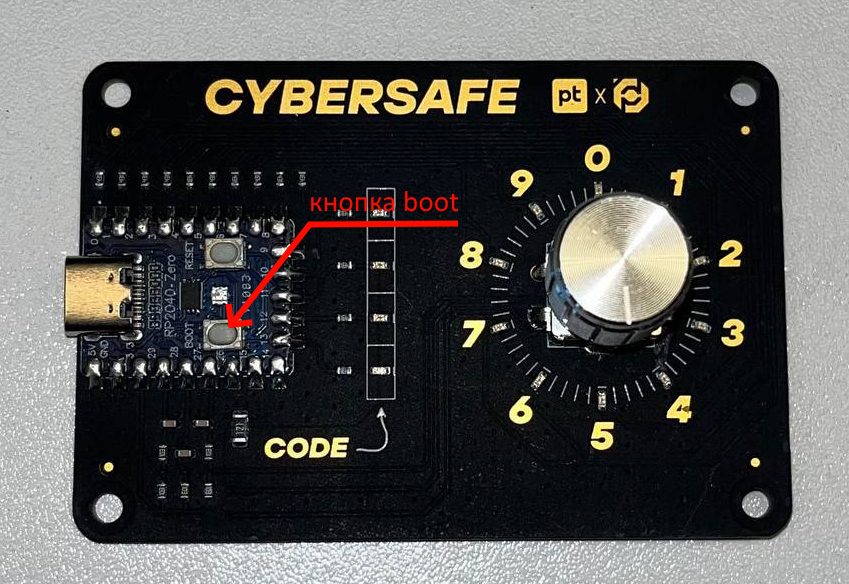

5. После этого перенести в появившийся диск файл обновлённой прошивки: [firmware_pin_0000.uf2](https://github.com/gestitech/hackaton_LDT2026/blob/main/Modified%20firmware/firmware_pin_0000.uf2)
   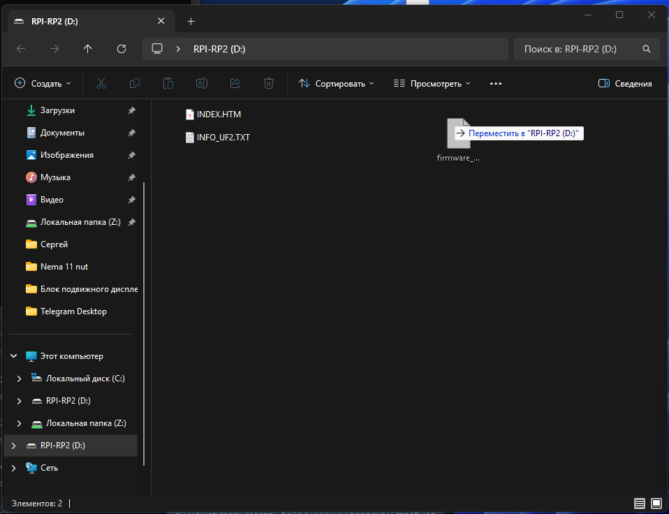
6. Далее плата перезагрузится, и можно будет разблокировать её с помощью кода: **0000**.

> (Метод работает только на платах с аналогичной исходной прошивкой. Для других прошивок надо модифицировать прошивку заново.)

**Видеоподтверждение:** [vkvideo.ru](https://vkvideo.ru/video-241723191_456239023?list=In-I7FZaIBJMMuRISb2d1)

---

### 5.2. Отключение PIN кода

При анализе `main()` был найден вызов функции `lock_ui()`:

```
0x100008A6: BL 0x10000A80
```

Таким образом, при нормальном запуске микроконтроллера выполнение программы доходит до `lock_ui()`, где пользователь должен ввести PIN. Вместо изменения самого PIN, как в предыдущем методе, в данном решении этот вызов был удалён из `main()`.

Строка:
```
0x100008A6: BL 0x100008A80
```

Была заменена на две (поскольку исходная инструкция занимала 4 байта) инструкции **NOP** (а NOP занимает 2 байта):
```
0x100008A6: NOP
0x100008A8: NOP
```

Соответственно, вместо перехода в `lock_ui()` процессор продолжает выполнение `main()` со следующей инструкции, которые в том числе отвечают за инициализацию **USB Mass Storage**.

Редактирование файла и пересборка в файл прошивки происходила аналогично предыдущему методу. При перепрошивке заменяется только прошивка, часть с файловой системой не перезаписывается.

Для прошивки использовался штатный режим **BOOTSEL** микроконтроллера RP2040, аналогично как и в предыдущем способе:

1. Микроконтроллер переводится в режим **BOOTSEL**.
2. Подключается к компьютеру по USB.
3. На появившийся USB-накопитель копируется `firmware_no_pin_v3.uf2`.
4. После перезагрузки начинается выполнение модифицированной прошивки.

**Файл обновлённой прошивки:** [firmware_no_pin_v3.uf2](https://github.com/gestitech/hackaton_LDT2026/blob/main/Modified%20firmware/firmware_no_pin_v3.uf2)

**Видеоподтверждение:** [vkvideo.ru](https://vkvideo.ru/video-241723191_456239024?list=In-FUeRDYFiFfzGKvLHma)

---

## 6. Финальный аккорд — копаем 1337 слоёв...

После того, как система защиты файловой системы была побеждена, осталось раскопать архивы... Что делать? Следуй шагам!

1. Распаковываем `your_prize.zip`
2. Читаем `readme.txt` -> грустим (1337 лапки устанут распаковывать)
3. Распаковываем `layers.zip`
4. Кладём в одну папку рядом с `layer_1.zip` наш скриптик [extractor.py](https://github.com/gestitech/hackaton_LDT2026/blob/main/Extract%20prize/extractor.py)
5. Запускаем скрипт командой:
   ```bash
   python extractor.py
   ```
6. Чуток ждём (около минутки) и получаем свой заветный `prize.html` (:

---

## Рекомендации

- **Переход на MCU с аппаратной защитой чтения и подписью прошивки** (например, STM32 с RDP Level 2, RP2350 с secure boot + OTP), либо шифрование flash с ключом в защищённой области.
- **Собирать прошивку с отключённым USB PicoBoot**.
- **Secure boot + проверка подписи .uf2**; запрет обновления прошивки без физического вскрытия (убрать кнопку BOOTSEL).
- **Хранить не PIN, а его хэш** (SHA-256 с уникальным salt).
- **Анти-брутфорс:** экспоненциальная задержка после ошибки, блокировка после N попыток, обязательная задержка при старте (иначе задержка обходится перезагрузкой по RST), счётчик попыток в энергонезависимой памяти.
- **Шифровать данные AES-256** (или ChaCha20) с ключом, выводимым из PIN через KDF (PBKDF2/Argon2). Ключ не хранить в прошивке — тогда дамп бесполезен без PIN.
- **Физическая защита:** заливка компаундом, отсутствие доступных тест-точек, tamper-детектирование вскрытия корпуса.
- **Отключать SWD в проде** (если MCU позволяет) и мониторинг отладочных интерфейсов.
